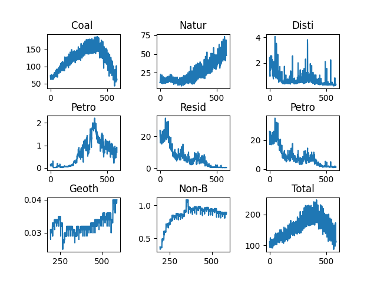
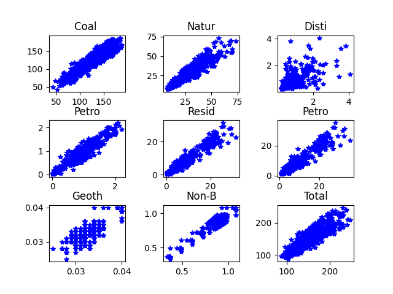
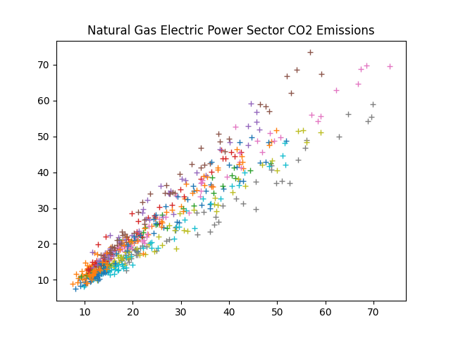
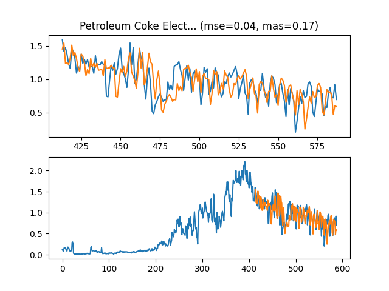
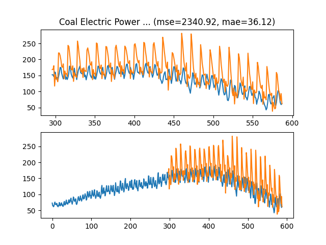
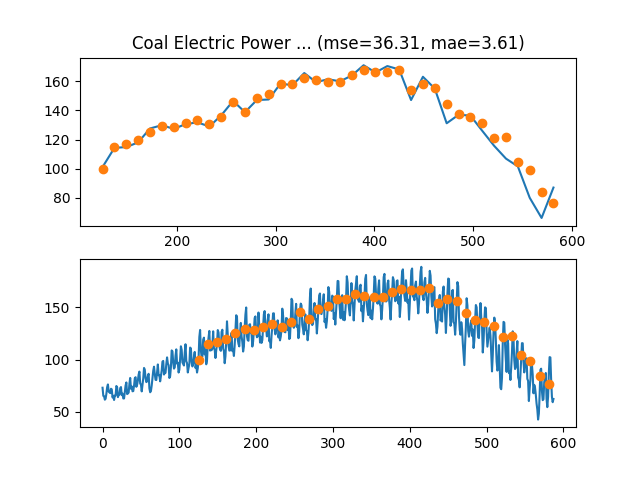
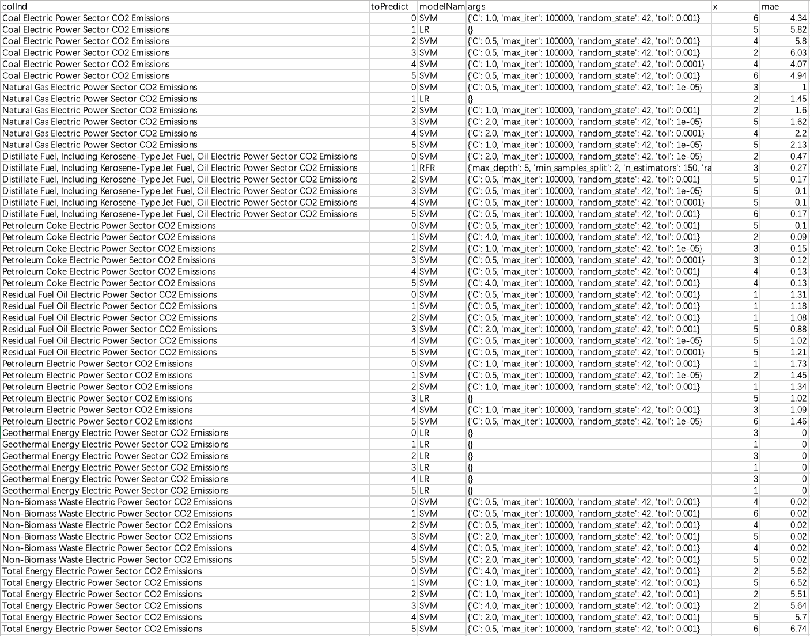
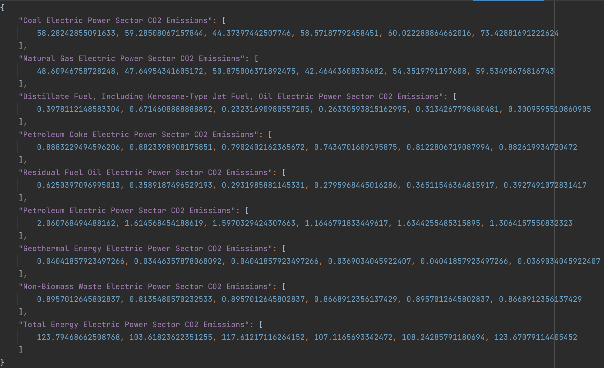

# 一些信息

## 成员

| 姓名   | 学号     | 备注 |
| ------ | -------- | ---- |
| 李远铄 | 19211332 | 组长 |
| 李潮乐 | 20281140 | 组员 |
| 赵东阳 | 20281029 | 组员 |


## 报告风格问题

我们没有按照报告模板做报告，原因很简单：我们的思考过程是前后依赖的，并不是常规的“提出一系列模型-参数选择-验证模型效果-选择模型-预测结果”，而是“发现数据集特征-提出模型-否决-根据motivation提出新模型-否决-...-根据motivation提出最终模型-使用模型预测-补充实验讨论其他的模型因素”，我们的报告也需要遵从这个思路。

此外，我们不会在报告中贴“核心代码”，取而代之的是，我们会详尽描述模型构建方式，之后指出代码对应的文件。这是因为我们的模型都比较复杂，核心代码几乎就是全部代码，贴了之后反而让报告变得复杂。


## 代码与图片的路径问题

我们代码仓库地址是：[GitHub Repo](https://github.com/ipChrisLee/bjtu_ml_proj)。如果课程平台允许的话（仓库包括不少图，可能超过了平台附件限制），我们也会压缩一份完整仓库到平台上。

之后我们描述的代码或者图片的路径都是相对代码仓库根的路径，您可以随时查看比对。此外，我们的图片生成路径信息几乎都编码在了src/config.py下（这些路径也是相对项目根的路径），您也可以根据此轻松判断图片是由什么代码生成的。

本文档的markdown版本也存在了仓库中，为docs/keynote.md。


## 其他

* 我们会使用指标的前4或5个字符来指代指标。
* 我们仓库里所有代码都应该在项目根目录运行，否则会直接报错拒绝运行。


# 问题描述和数据集分析

## 阐述问题

简单来说：我们要做的是碳排放预测。

我们的数据总共有 9 个碳排放的指标，其中 7 个指标有 1973 年 1月起，一直到 2021 年 12 月的所有月份的数据；剩下2个指标则有 1989 年 1 月起，一直到 2021 年 12 月的所有月份的数据。我们要利用这些数据来预测2022年1月到6月的这9个指标数据。


## 模型选择基准

数据集的数据量不大，且考虑到作为机器学习课程的最终项目，我们最终选择的基础模型都是课上学过的模型，没有使用LSTM这类很火但是过分复杂且在教学之外的模型、或者诸如ARIMA在内的课内没涉及过的标准时间序列分析方法。

具体来说，我们只选择了三种基模型：

* 线性回归

  也称Linear Regression、LR。

* 线性SVM回归

  也称Linear SVR、SVR。

* 随机森林回归

  也称Random Forest Regression、RFR。

实际上，由于代码的结构性很好，我们可以随意更改基模型，这里只是展示这几个模型的效果。


## 数据集分析

### 周期性

我们使用自相关系数判定指标是否有12这个周期。

在判断前，我们做了一个预处理：对于每一个指标y年m月的数据，我们都将它除以这个指标y年的数据和，这样可以一定程度上排除趋势性影响。

| 指标名（前5字符） | 间隔为12的自相关性 |
| - | - |
| Coal  | 0.9202 |
| Natur | 0.9279 |
| Disti | 0.8330 |
| Petro | 0.9421 |
| Resid | 0.9204 |
| Petro | 0.9128 |
| Geoth | 0.6345 |
| Non-B | 0.7385 |
| Total | 0.9369 |

> 生成这个表的代码见src/period_check.py。

结论：大多数指标周期性显然,因此我们需要考虑周期性对时间序列分析的影响。


### 相关性

下面的相关性都是Pearsons相关系数。

我们先可视化一下各个数据的变化曲线，来做定性分析：



> 图片路径：vi_img/visual_data/all_in_one.png，由src/visualize.py生成。

看起来不少指标之间有相关性。

实际上分析相关性后,发现部分数据相关性确实很高。比如"Resid" 和"Petro" 的相关系数达到了 0.9951。

所有数据之间的相关系数表见result/cor_mat.csv，由src/correlation_analyze.py生成。

因为数据之间有相关性，所以我们需要考虑相关性对我们建模的影响。


### 隔月线性关系

#### 简单描述

**一般会将时间序列分析问题转化成监督学习问题**，即用前一(几) 月的数据预测后一 (几) 月的数据，所以我们想看看“一个月数据与下一个月数据的关系”。举个例子，对于`[1, 2, 3, 4]`这个数据，“前一个月-后一个月的数据”就是`[(1,2), (2,3), (3,4)]`，我们可以得到后一个月总是前一个月数据加一。

可视化结果如下：

 

> 图片路径：vi_img/pre_nxt/pre_nxt_all_in_one.png，由src/visualize.py生成。

可以看出，9个指标的前一个月和后一个月都具有线性关系！

#### 进一步分析

在“隔月线性关系”进一步看，“这个月数据与下一个月数据”的具体线性关系也和“这个月”是哪个月有关。以“Natur” 为例，按照“这个月”涂色后，它的“这个月数据与下一个月数据”关系图如下，可以看出不同颜色的点在不同线上。



> 图片路径：vi_img/pre_nxt_pm/total/Natural Gas Electric Power Sector CO2 Emissions.png，由src/visualize.py生成。

#### 与季节性、趋势性的关系

实际上数据的季节性就是隔月线性关系的体现：正因为月份之间是有线性关系的，所以每年里各个月份数据变化趋势是相同的。

我们的预测不太需要考虑趋势性，只需要根据现有的数据预测新的半年数据就行，这个任务更体现季节性。


# 模型介绍

## Navie模型

### 简述

以“时间序列预测转监督学习”为基础，在“隔月线性关系”的启发下，我们可以得到这么一个想法：

对于每一个指标，训练一个模型，它以当月的为输入，输出下一个月的数据。

因为我们需要预测后6个月的数据，所以我们需要**滚动预测**：我们需要去年12月的数据，通过模型预测今年1月的数据，然后再用这个1月的数据预测2月的，以此类推。

```
12 -()-> [1]
         [1] -()-> [2]
                   [2] -()-> [3]
                             [3] -()-> [4]
                                       [4] -()-> [5]
                                                 [5] -()-> [6]
```

### 结果

但是这个效果很不好。在src/navie_lr.py和src/navie_rfr.py中我们使用这种模型，然后使用全部数据作为测试集，滚动预测6个月后数据预测出来的结果：



> 图片路径：result/naive_lr/vi_img_for_6_day_pred/Petroleum Coke Electric Power Sector CO2 Emissions.png，由src/navie_lr.py生成。

可以看出，不能说毫不相关，也只能说是完全不匹配了。

### 分析

其实很好理解：前面提到，隔月线性关系本质是季节性的反映，它表示一年里，数据的变动是有规律的，但是我们的这个模型默认规律是不变的——这就不对了，实际上正如我们前面提到的，“隔月线性关系”的具体线性关系是什么样的也和月份有关！我们不能只用一个模型做这个预测。


## X2Y模型原理

### motivation和简述

我们分析navie模型失败的原因时提到，我们应该利用“‘隔月线性关系’和起始月份是哪个月有关”这个性质。也因此，我们提出一种预测方法，我们称之为X2Y模型：

具体来说，我们在“已有数据”与“将要预测的数据”之间划一条线。对于每一种指标：

```
X2Y modules begin at 1
					  X  |  Y
X=1, Y=1            (12) | [01]
X=2, Y=1       (11) (12) | [01]
X=1, Y=2            (12) | [01] [02]
X=2, Y=2       (11) (12) | [01] [02]
```

这里表示预测1月开始的Y个月的数据的、根据X与Y的值划分的四种模型。

* Y=1的模型我们又称X2O模型，它接受输入1月之前X个月的数据，输出1月的数据。

  * 其中X=1的模型我们称为O2O模型，它接受1月之前的1个月（也就是12月）的数据，输出1月的数据。
  * 其中X大于1的模型我们称为M2O模型，它接受1月之前的M个月（也就是12月）的数据，输出1月的数据。

  如果我们使用X2O模型，就需要做滚动预测：以M2O（M=2）为例，我们需要：

  ```
  (11) (12) -{a}-> [1]				//	模型a获得11、12月数据，输出1月的预测
       (12) [1] -{b}-> [2]			//	模型b获得12月、上一个模型预测的1月数据，输出2月的预测
            [1] [2] -{c}-> [3]		//	模型c获得预测的1、2月数据，输出3月的。
                 ...					//	以此类推
  ```

* Y大于1的模型我们又称X2M模型，它接受输入1月之前X个月的数据，输出之后**M个月种某个月**的数据。

  注意：X2M模型一次输出一个月的！这使我们在预测的时候可以对不同月使用不同的模型。举个例子：

  ```
  (11) (12)      -{a}->             [4] 
  (10) (11) (12) -{b}->                 [5]
  (12)           -{c}->                     [6]
  ```

  这里有三个模型，分别是X2M（X=2）的模型a、X2M（X=3）的模型b、X2M（X=1）的模型c。对于不同的月份虽然它们都被归类成了X2M模型，但是它们实际上只负责一个月的预测，比如a模型只预测4月的数据，b模型只预测5月的，c模型只预测6月的。

  之所以用X2M与X2O作区分，是因为X2M模型和X2O模型的最大区别就是：前者是分别预测，后者是滚动预测。


## X2O模型

### motivation

出于“分别预测3月和2月的关系、2月和1月的关系直接预测3月和1月的关系好”的想法，我们先尝试的是X2O模型。这里只是做尝试，所以数据集划分是“全部数据作为训练集，后50%数据作为测试集”。

### 结果

很遗憾，效果非常差。我们看滚动预测第6个月的情况：



> 图片路径：result/m2o_mon_lr/vi_img_for_6_day_pred/Coal Electric Power Sector CO2 Emissions.png，由src/m2o_mon_model.py生成。

可以看出来，后面的结果基本上可以看作跑飞了。

### 分析

其实原因挺好分析的：**滚动预测，不仅预测值在滚，误差也在滚，而且越滚越大**。

怎么解决问题呢？如果想要缩小误差的话，可能需要更复杂的模型，但是这是不可能的——这个问题的数据量压根不支持这么做（在分月预测后，每个子模型只有50条数据）。

怎么办呢？

## X2M模型

### motivation

我们一开始使用X2O的原因是：“分别预测3月和2月的关系、2月和1月的关系直接预测3月和1月的关系好”。

但是真的这样吗？

由于“隔月线性关系”，所以其实也有“隔两月线性关系”、“隔三月线性关系”！

所以直接分隔预测就行！完全没必要承担“滚动误差”的影响！

### 结果

在“全部数据作为训练集，后70%数据作为测试集”的划分下，得到的结果：



> 图片路径：result/m2o_sep_rfr/vi_img_for_6_day_pred/Coal Electric Power Sector CO2 Emissions.png，由src/m2o_sep_model.py生成。

可以看出来，不仅看起来更好，mae也相比X2O有很大的下降。

就决定是你了！

# 模型结果

## 模型选择

我们确定了使用X2M模型，但是就如前面所说，X2M模型是可以组合使用的。

具体来说，**对于每一个指标下的每一个需要预测月份，都有：**

1. X2M中X是多少。
2. 模型选什么。
3. 模型参数是什么。

这些参数需要选择。


举个例子，如果

1. 我们对于Coal指标的1月选择X=2、LR模型、模型参数组LR-a。我们称之为a模型。
2. 我们对于Coal指标的2月选择X=1、LR模型、模型参数组LR-b。我们称之为b模型。

那么我们最终做的就是：

1. 输入2021年11月、12月的Coal数据到模型a，获得1月的预测值。
2. 输入2021年12月的Coal数据到模型b，获得2月的预测值。


## 筛选结果

我们编码了上述网格搜索，使用5折交叉验证下mae的值作为评价指标，筛选出了一系列模型：



> 为result/x2o_sel/total_result.csv的截图，由src/x2o_selector.py生成。

这里的colInd就是需要预测的指标名，toPredict就是预测月份（从0开始），modelName就是选择的模型，args就是对应模型的参数，x就是X2M模型中X的值，mae就是5折交叉验证下的mae。


## 预测结果

在选择完模型之后，我们编码实现了自动读取csv文件、生成模型、执行预测的流程（即src/final_predict.py），获得了结果result/total_res.json。



> 为result/total_res.json的截图，由src/final_predict.py生成。


# 其他研究

## 数据处理

除了相关性分析那部分的模型外，我们没有对数据做预处理。对于常用的数据处理分别讨论：

* 异常数据剔除：对于气象数据这种经过反复确认、科学获得的数据，我觉得剔除反而是不当的。
* 数据增强：我们的预测就是基于“隔月线性关系”，也就是基于一种线性关系，此时，插值类的数据增强不会对训练过程造成决定性影响。


## 可解释性

虽然使用的备选模型(Linear SVR, Linear Regression, Random Forest Regression)中，随机森林的可解释性不太好，但是最终选择的模型中只有一个是随机森林，所以结果整体上说可解释性很高。


## 联合预测

前面提到，我们目前都是将所有指标单独预测，但是是不是说我们可以将多个指标放在一起预测呢？

对于相关性强的指标：

* 我们前面的实验结果其实可以看出，这里线性SVM和线性回归是比较适合的选择，这种情况下，相关性强的指标放在一起预测只会带来干扰。

*  不过我们还是补了实验：即使是对相关性最高的"Resid"和"Petro"做联合预测模型的网格搜索，mae也不如我们前面得到的模型。

  实验代码：src/cor_based_model.py；实验结果见result/cor_based_model/resid-petro_result.csv。

对于相关性不强的指标：

* 这里我想不出原理上反对"相关性不强的指标做联合预测"的理由。

* 不过由于src/cor_based_model.py的代码实现没有写死哪些指标能做联合预测，所以相关实验补起来很容易。我们对相关性不高的"Resid"和"Natur"指标做网格搜索，mae也不如我们前面得到的模型。

  实验代码：src/cor_based_model.py；实验结果见result/cor_based_model/Resid-Natur_result.csv。

注：这里联合预测的指标都做了归一化，mae指的是5折交叉验证的mae。


# 后记

## 趣事

我们介绍的时候是按照我整理过后的思路介绍的，但是其实我们做的时候是完全不同的节奏。

我们最初的进展来自于bug：

在一开始，抱着死马当作活马医的心态，写了Navie模型的代码，然后发现效果巨好，觉得不对，“怎么会这么好呢？”。隧认为数据集一定是有“玄机”的，于是才发现了“隔月线性关系”这个至关重要的性质，并基于此提出X2Y模型。但是比较搞的是，实际上当时写的代码是有bug的，效果好只是那个bug会让效果看着很好。不过最后结果上来说，这个bug推进了我们的工作（

我们一开始确实不觉得X2M模型比X2O模型好，所以当我们发现即使是O2M都比M2O效果好时，有点绷不住。


## 作业实现感悟

赵东阳：本次实验通过运用所学的向量机,线性回归,随机森林等知识,对时间序列预测问题进行建模和编写代码上机实现,通过一步步分析数据集和相关结果,得到了自己的分析方法和实验结论,增强了解决实际问题的能力。在小组合作中,可以借鉴到其他同学的思路,集思广益,取长补短。

李潮乐：本次实验不同于之前的上机实验老师已经给出思路和模板,而是根据问题自己确定实验的思路和模型、参数的选择,所以难度还是比较大的。还好小组成员们的思路都很开阔,想到了上述这些方法和模型。锻炼了分析问题和解决问题的能力,也知道了小组合作对于完成项目来说的效率和质量比个人来说是更高的。

李远铄：这是我为数不多做AI做“爽”了的。从一开始的一筹莫展，到发现数据性质，到根据数据性质提出一系列实验和模型，到根据模型效果分析、更改模型，每一步都是“有所依据”的，每一步都是经过思考的，这个过程才是我最喜欢的。


## 分工

* 李远铄
  * 整体程序框架构思。
  * 完成基础模型构思。
  * 完成分析“隔月线性关系”的代码编写。
  * 参与分析数据相关性、周期性代码编写。
  * O2O模型、M2M模型的编写。
  * 可视化代码编写。
  * 汇报Keynote和汇报工作。
* 李潮乐
  * 提供数据相关性、周期性分析思路。
  * 参与分析数据相关性、周期性代码编写。
  * M2O模型的编写。
  * 利用相关性联合预测的模型的编写。
  * 实验报告撰写。
* 赵东阳
  * O2M模型的编写。
  * 利用相关性联合预测的模型的编写。
  * 实验报告撰写。
